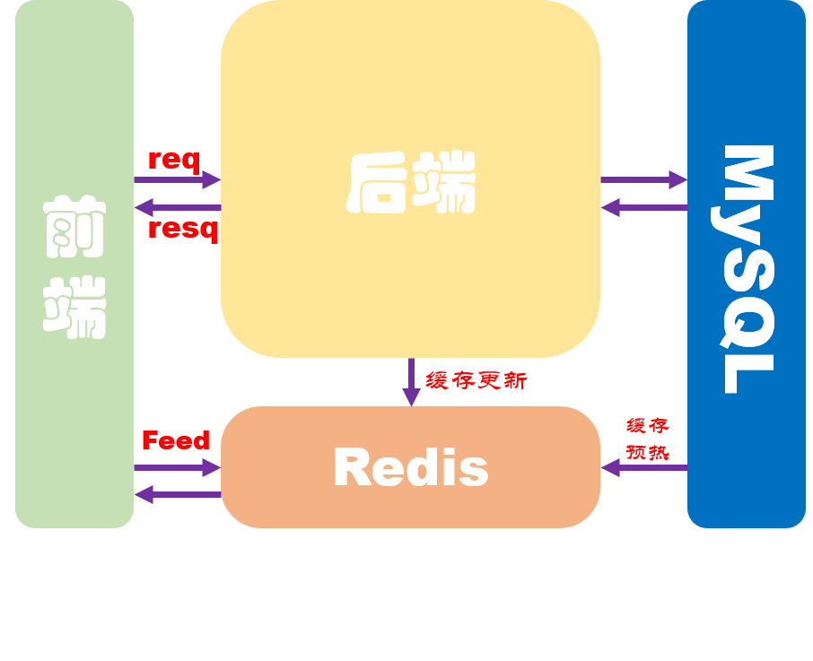
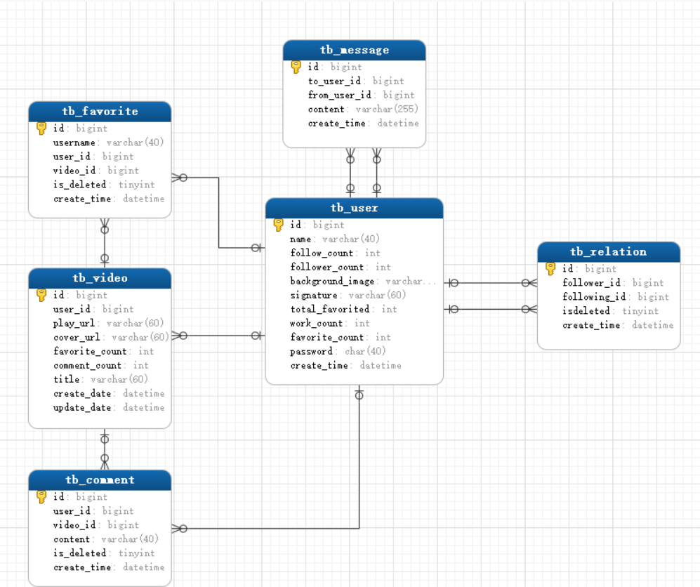

# 一、项目介绍

**项目介绍：**基于 Gin + GORM + Redis + MySQL 的 Golang 后端项目——第五届字节青训营极简版抖音后端实现

**代码仓库：**[抖声](https://github.com/conason/dousheng)—>https://github.com/conason/dousheng

# 二、项目分工

| 团队成员   | 主要贡献                                                     |
| ---------- | ------------------------------------------------------------ |
| shuxCoding | 负责视频、用户模块开发；完成视频OSS存储、JWT鉴权、pprof测试  |
| conason    | 负责互动、社交模块开发；完成Redis视频推流、ffmpeg视频帧抽取、敏感词过滤、优化部分SQL |


# 三、项目实现

## 3.1 技术选型

* **单体框架：**Gin
* **数据库：**MySQL
* **缓存层：**Redis
* **ORM:** GORM
* **OSS：**七牛云

## 3.2 架构设计

本项目的系统架构采用单体结构，后端框架选用GIN+GORM完成开发。功能完整，结构清晰。引入Redis为feed请求加速响应并优化视频推流逻辑。



**数据库UML**



## 3.3项目代码目录介绍

```shell
dousheng                         
├─ config                        #配置文件      
│  ├─ config.go                  
│  └─ sensitive_words_lines.txt  #敏感词典
├─ dao                           #ORM
│  ├─ build                      #GORM gen builder
│  │  └─ main.go                 
│  ├─ dal                        #GORM GEN dal
│  └─ model                      #GORM GEN model               
├─ handlers                      #handler层，接口逻辑实现
├─ middleware                    #中间件
│  └─ JWT.go                     
├─ service                       #服务层，业务接口定义
│  └─ serviceImpl                #接口逻辑实现
├─ utils                         #工具类
│  ├─ dateFMTConv.go             
│  ├─ ffmpeg.go                  
│  ├─ md5.go                     
│  ├─ qiNiuCloud.go              
│  ├─ redis.go                   
│  ├─ resolveError.go            
│  ├─ statusMsg.go               
│  ├─ token.go                   
│  └─ wordsFilter.go            #敏感词过滤器  
├─ go.mod                        
├─ go.sum                         
├─ main.go                       
└─ router.go                    #路由            

```


# 四、项目总结与反思

##1.目前仍存在的问题

* 项目是 Gin 单体项目
* 存在代码冗余，代码实现不够优雅
* Redis缓存支持较少，项目中Redis仅用于视频推流以及缓存部分视频数据
* 性能瓶颈低，未引入消息队列组件不具备削峰平谷的能力

## 2.已识别的优化项

* 视频OSS存储，视频上传至七牛云
* 评论聊天内容进行文本过滤
* 视频基于Redis的ZSet进行推流，可以实现多种推流模式
* 优化并添加了索引结构

## 3.架构演进可能性

* 首先项目是单体架构，拆分成微服务架构是大势所趋
* 第二引入RPC框架，微服务之间的调用离不开RPC
* 第三引入MQ组件，服务间的调用随业务的增长指数上升，引入MQ削峰平谷增加服务的稳定性
* 第四引入缓存组件，缓存的对象不只是数据库数据，也可以是请求响应数据即构建多级缓存机制
* 第五引入链路控制组件，服务间调用应该可控，链路控制组件有效的支持服务调用策略（限流、熔断等等）
* ...架构演进大体上的方向就是开发出越来越`专业且独立`的组件，交由这些组件为系统提供高效稳定的中间服务

## 4.项目总结及展望

### 总结

* 项目开发时间规划不合理，前松后紧
* 项目选型不够灵活，前期专注于开发微服务项目，但是受限于人手后期又转为单体服务
* 开发过程中写了很多bug，没有理清业务逻辑急于求成反受其害，debug耽误了一些时间
* 项目基本功能全部实现，总体完成度很高

### 展望

* 拆分服务，用Herz+Kitex代替Gin
* 丰富Redis缓存，目前仅使用ZSet作为视频推流缓存
* 优化JWT鉴权逻辑，将静态token转换成动态token
* 引入消息队列增强服务稳定性
* 优化表结构，增加冗余字段，减少嵌套查询，连锁更新问题

